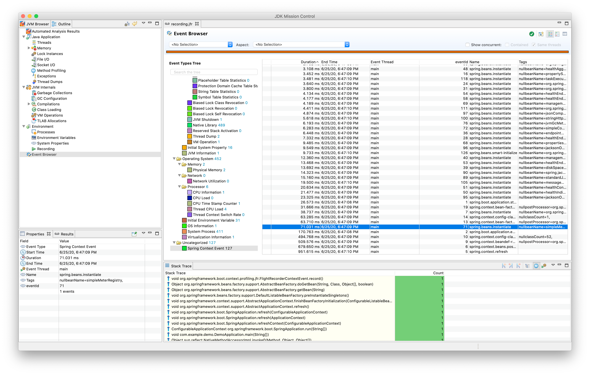
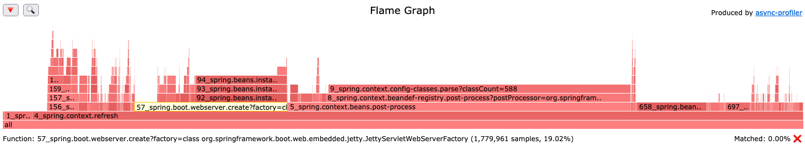

# Spring Startup To Collapse Stack

spring-startup-to-collapse-stack is CLI tool converting output of 
[startup endpoint](https://docs.spring.io/spring-boot/docs/current/actuator-api/htmlsingle/#startup)
to collapse stack format. Collapsed stack can be converted to the flame graph with help of 
[AsyncProfiler](https://github.com/jvm-profiling-tools/async-profiler).

## Motivation

Spring Boot allows to gather startup metrics since version 
[2.4.0](https://spring.io/blog/2020/11/12/spring-boot-2-4-0-available-now) 
([actuator docs](https://docs.spring.io/spring-boot/docs/current/actuator-api/htmlsingle/#startup), 
[Spring Boot docs](https://docs.spring.io/spring-boot/docs/current/reference/htmlsingle/#features.spring-application.startup-tracking),
[Spring Framework docs](https://docs.spring.io/spring-framework/docs/current/reference/html/core.html#context-functionality-startup)).
However there is lack of tool to visualize where our Spring Boot app spends time during the startup.
Startup events could be gathered by JFR events and shown in JDK Mission Control:

or can be listed by actuator as a json:
```json
{
  "springBootVersion": "2.5.4",
  "timeline": {
    "startTime": "2021-10-09T17:35:50.813987Z",
    "events": [
      {
        "endTime": "2021-10-09T17:35:50.899008Z",
        "duration": 0.021545,
        "startupStep": {
          "name": "spring.boot.application.starting",
          "id": 0,
          "tags": [
            {
              "key": "mainApplicationClass",
              "value": "com.github.wyhasany.Application"
            }
          ]
        },
        "startTime": "2021-10-09T17:35:50.877463Z"
      },
      "..."
    ]
  }
}
```
Both approaches are troublesome to analyze that data.

We can reinvent the wheel and create new visualization tool as it was tried before (
[[1]](https://ik.am/eventviewer),
[[2]](https://alexey-lapin.github.io/spring-boot-startup-analyzer/),
[[3]](https://spring-boot-startup-analyzer.netlify.app/)).
Or we can reuse flame graphs which ideally fits for that purpose. That approach has been
chosen by this project.

Example generated flame graph:


### Usage

#### Spring configuration

Configure your app to collect startup events:

```java
@SpringBootApplication
public class App {
    public static void main(String[] args) {
        new SpringApplicationBuilder()
            .applicationStartup(new BufferingApplicationStartup(2048))
            .sources(Application.class)
            .run(args);
    }
}
```

#### Download startup json

```shell
curl localhost:8091/actuator/startup > startup.json
```

#### Download spring-startup-to-collapse-stack converter
```shell
curl -L https://github.com/wyhasany/spring-startup-to-collapse-stack/releases/download/0.1-alpha/converter-spring-boot-startup.jar --output converter-spring-boot-startup.jar
```

#### Convert `startup.json` to collapse format

Keep in mind to use JDK 16
```shell
java -jar converter-spring-boot-startup.jar startup.json startup.collapse
```

#### Convert collapse format to HTML 5 Flame Graph
```shell
# Download async-profiler's converter
curl -L https://github.com/jvm-profiling-tools/async-profiler/releases/download/v2.5/converter.jar --output converter.jar
# convert to flame graph
java -cp converter.jar FlameGraph startup.collapse output.html
```

Open it in browser and explore as other Flame Graphs. 

Note:

Shown samples actually refers to the duration µseconds of given step.
